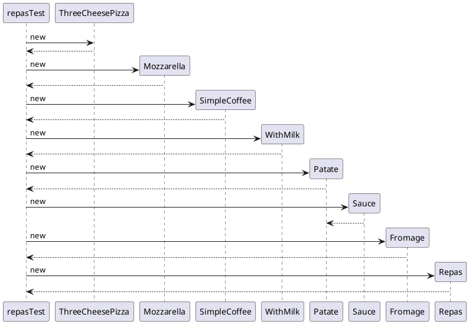

```plantuml
skinparam Style strictuml

Interface IIngredient<<Interface>>{
    getCost(): double
    getIngredients(): String
}
class ThreeCheesePizza implements IIngredient{
    getCost(): double
    getIngredients(): String
}
class Mozzarella implements IIngredient{
    getCost(): double
    getIngredients(): String
}
class SimpleCoffee implements IIngredient{
    getCost(): double
    getIngredients(): String
}
class WithMilk implements IIngredient{
    getCost(): double
    getIngredients(): String
}
class Patate implements IIngredient{
    getCost(): double
    getIngredients(): String
}
class Sauce implements IIngredient{
    getCost(): double
    getIngredients(): String
}
class Fromage implements IIngredient{
    getCost(): double
    getIngredients(): String
}
class Repas{
    calculDesrepas(): double
}
class RepasTest


@startuml

repasTest -> ThreeCheesePizza : new
ThreeCheesePizza --> repasTest

create Mozzarella
repasTest -> Mozzarella : new
Mozzarella --> repasTest

create SimpleCoffee
repasTest -> SimpleCoffee : new
SimpleCoffee --> repasTest

create WithMilk
repasTest -> WithMilk : new
WithMilk --> repasTest

create Patate
repasTest -> Patate: new
Patate --> repasTest

create Sauce
repasTest -> Sauce:new
Sauce --> Patate

create Fromage 
repasTest -> Fromage:new
Fromage --> repasTest

create Repas
repasTest -> Repas:new
Repas --> repasTest

@enduml


```